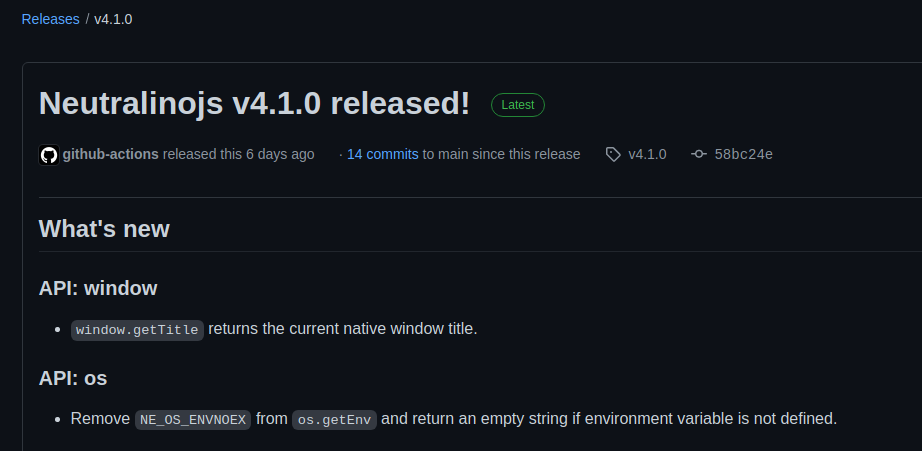

Earlier, the software development lifecycle was simple&mdash;we didn't have automated feature delivery,
complex application health checks, cloud-based test suites, etc. Later, the DevOps movement drastically
changed the software development processes by motivating developers to automate everything.
DevOps helped software development teams to productively build high-quality software, deliver features/patches
so fast, and make software systems stable.

<!--truncate-->

There were no DevOps practices in the early development stages of the Neutralinojs framework. We did framework
releases manually by manually collecting release notes. We manually compiled the framework on different
platforms before releasing a new version. The release process was too much time-consuming since there were
no automated workflows to support our development-related activities.

Now we save many hours thanks to the newly implemented DevOps-first development process. In this article,
we'll explain how Neutralinojs's DevOps processes work&mdash;and how automation helps us to save development time.
You can use these DevOps practices in your projects to save your time too.

## Troubles with the Manual Repetitive Activities

We didn't use any automated workflow with initial Neutralinojs development activities&mdash;and had only three
build scripts to produce framework's binaries on Linux, macOS, and Windows. We faced the following troubles
before implementing a DevOps-first development environment.

- The maintainer had to compile every pull request manually before merging to the main development branch.
- Releases had too many changes and [broke APIs](https://github.com/neutralinojs/neutralinojs/issues/654#issuecomment-945853188)
sometimes due to the time-consuming manual release process.
- The release note generation process was too time-consuming&mdash;we had to go through old commits manually and
build up a summary before every release.
- If a new source code modification broke an existing feature, we typically noticed it when a developer
reported the issue via a GitHub issue.
- Developers didn't have scripts to automate their development activities in their local computers.
They didn't have scoped test cases to verify code modifications locally before pushing to the GitHub repository.

As you already noticed, the previous development workflow isn't DevOps-first and not suitable for
modern open-source projects.

## How We Implemented DevOps Concepts

We cannot integrate DevOps concepts into our projects instantly&mdash;DevOps integration is a step-by-step
process that we need to do by selecting the most suitable tools and workflows. Our goal was to build a
DevOps pipeline for the following critical requirements.

- Verifying every code change (commit) with a cloud-based automated test suite
- Creating a release package with pre-built binaries for Linux, macOS, and Windows
- Generating meaningful release notes based on a changelog file
- Implementing a way for developers to verify their code changes locally with scoped test cases
(This is basically about running the automated test suite locally for a specific module)
- Boost developers' productivity by offering some Shell scripts to automate manual tasks

We built our DevOps pipeline with the following steps.

### Step 0: Writing Some Shell Scripts to Boost Developers' Productivity

We need to automate local development activities before we think about remote CI/CD workflows. Entering
the same Unix commands set multiple times reduces programmers' programming productivity. Therefore, we
initially wrote the following Shell scripts to automate local development activities.

- [`scripts/update_client.sh`](https://github.com/neutralinojs/neutralinojs/blob/main/scripts/update_client.sh):
Updates the test app's JavaScript client library by building a new version
from the source. This script is helpful when a developer adds new features to the Neutralinojs JavaScript API.
- [`scripts/make_res_neu.sh`](https://github.com/neutralinojs/neutralinojs/blob/main/scripts/make_res_neu.sh):
Updates the test app's resources bundle by building it again from local files.
This script is helpful when a developer works with the resource loader and static file server modules.

### Step 1: Building a Better Test Suite
Programmers often change source files to add new features and fix software bugs. A simple code change
can silently introduce a new software bug even though you review the code changes thoroughly. Therefore,
we need test suites to prevent software bugs.

Neutralinojs is written in two languages: C++ and JavaScript. Therefore, we wrote an integration test
suite to test both C++ and JavaScript code changes at once. Our integration test suite uses the
[Mocha](https://github.com/mochajs/mocha) test framework. Neutralinojs JavaScript API communicates with
the main framework runtime via a WebSocket connection, so how can we build an integration test suite
around this?

Every Neutralinojs test case spawns a Neutralinojs app instance and captures the serialized program output
from a file. You can browse the source code of this test runner program from the
[`spec/runner.js`](https://github.com/neutralinojs/neutralinojs/blob/main/spec/runner.js) file.
See how we test the [`os.execCommand`](https://neutralino.js.org/docs/api/os#osexeccommandcommand-options)
API function with the following specification.

```js
describe('os.execCommand', () => {
    it('executes a command and returns result', async () => {
        runner.run(`
            let info = await Neutralino.os
                        .execCommand('node --version');
            await __close(JSON.stringify(info));
        `);
        let info = JSON.parse(runner.getOutput());
        assert.ok(typeof info == 'object');
        assert.ok(typeof info.pid == 'number');
        assert.ok(typeof info.stdErr == 'string');
        assert.ok(typeof info.stdOut == 'string');
        assert.ok(typeof info.exitCode == 'number');

        assert.ok(info.stdOut.charAt(0) == 'v');
    });

    it('accepts stdIn', async () => {
        runner.run(`
            let info = await Neutralino.os.execCommand('node',
                        {stdIn: 'console.log("N");'});
            await __close(JSON.stringify(info));
        `);
        let info = JSON.parse(runner.getOutput());

        assert.ok(info.stdOut.charAt(0) == 'N');
    });
});
```

Here we can use `runner.run()` function to execute an arbitrary JavaScript code inside a Neutralinojs
application instance via the Node.js context. The `__close()` function helps to save the output and
close the application via the application context. Finally, we can use the `runner.getOutput()` function to
read the application instance output. We wrote our entire integration test suite by using this approach.

You can learn more internal details about our test suite from the following YouTube video:

<iframe height="480" width="100%" src="https://www.youtube.com/embed/DdlzDklYHVs" title="YouTube video player"
    frameborder="0"
    allow="accelerometer; autoplay; clipboard-write; encrypted-media; gyroscope; picture-in-picture"
    allowfullscreen>
</iframe>


Also, you can browse the full source code of our integration test suite from
[here](https://github.com/neutralinojs/neutralinojs/tree/main/spec).
We can verify our code changes before pushing them to the remote repository via the following command.

```bash
cd spec
npm run test <module>
```

For example, if you've done a modification in the app module, you can enter `npm run test app` for running
app test cases that are defined in the app scope, as shown below.


### Step 2: Building the Continuous Integration (CI) Workflow

We use a pull request-based source code management model, but sometimes we push quick fixes directly to the
main development stream. Therefore, our GitHub Actions-based CI workflow gets invoked on every pull request
and commit. Once the workflow is invoked, it does the following operations:

- Compiling binaries on Linux, macOS, and Windows
- Running the test suite on Linux and macOS

GitHub Actions VMs doesn't have built-in display devices, so our test suite runs on Linux with the
[Xvfb](https://en.wikipedia.org/wiki/Xvfb) (X virtual frame buffer) tool. You can check the source code
of the CI workflow from [here](https://github.com/neutralinojs/neutralinojs/blob/main/.github/workflows/test_suite.yml).

### Step 3: Building the Continuous Delivery (CD) Workflow

Nowadays, everyone tends to generate release notes automatically via commit messages. But, we implemented
a changelog-based release note generation concept due to the following problematic situations.

- We didn't like to force new contributors to follow a strict commit convention.
- Commit messages are literally saying what's changed&mdash;they don't give a meaningful overview about what
we are delivering in a particular release.

Therefore, we built our own minimal release note generation solution called
[ReleaseZri](https://github.com/codezri/releasezri). ReleaseZri generates
release notes based on a changelog file and markdown template. Now when the maintainer invokes the
framework's CD workflow with a version number, the following operations will happen automatically.

- Building x64 binaries on Linux, macOS, and Windows
- Generating release notes from the CHANGELOG.md file
- Publishing a new GitHub release with build artifacts and release notes
- Notifying the developer community via a Discord bot

ReleaseZri helped us to automate the CD workflow of the following repositories.

- [Neutralinojs framework](https://github.com/neutralinojs/neutralinojs)
- [Neutralinojs client library](https://github.com/neutralinojs/neutralino.js) 
- [Neutralinojs CLI](https://github.com/neutralinojs/neutralinojs-cli)

## Conclusion

Now every software development team strives to implement DevOps workflows to release features rapidly
and stay competitive in the modern software development market. DevOps concepts help us to build high-quality
software products by automating every manual step.

We save many hours with the DevOps culture at the Neutralinojs codebase. Now we can generate releases
with a single mouse click with GitHub Actions, as shown below.


The above action creates a [release](https://github.com/neutralinojs/neutralinojs/releases/tag/v4.1.0)
with meaningful release notes, as shown below.



If your software product doesn't follow a DevOps-first
architecture yet, consider implementing some DevOps principles, see how much time you can save.
