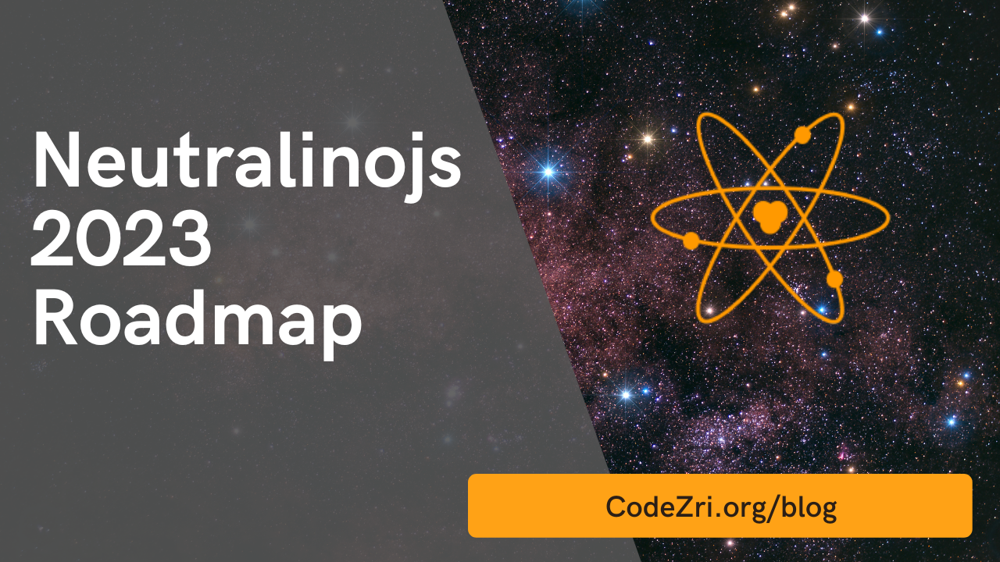

We typically publish a set of goals for the upcoming year and let you know the current year's achievements at
the end of every year via a blog post. For example, we published
the ["Neutralinojs 2022 Roadmap"](./2021-12-27-neutralinojs-2022-roadmap.md) article on December 2021.
Similarly, we are publishing this article for the year 2023. We are happy to announce that we completed
most of the planned goals in 2022. We made Neutralinojs stable and competitive by implementing
DevOps principles and doing various performance, architectural, security, and source-code-level enhancements.

<!--truncate-->

## Achievements in 2022

Look at the following summary of things we achieved in 2022:

- Delivered new APIs for accessing the system clipboard, spawning processes, retrieving system information,
adding custom backend code execution, and handling event-based file streams. 
- Added new functions for the filesystem, os, and storage modules
- Implemented a protection mechanism to prevent loading the app outside of the webview by using an OTT
(One-Time Token). Read more about Neutralinojs framework security from
the [official documentation](https://neutralino.js.org/docs/contributing/security).
- Started generating official nightly releases with the [ReleaseZri](https://github.com/codezri/releasezri)
project. This DevOps improvement helps developers experiment with the latest framework features.
- Generated official ARM binaries for Linux (armhf and arm64) and macOS (arm64 for M1 or higher)
- Developed the [BuildZri](https://github.com/codezri/buildzri) open-source project as the build automation
tool for compiling the Neutralinojs C++ codebase
- Improved the codebase quality and fixed various bugs to make Neutralinojs stable for developing
production-level apps
- Mentored one project idea with the Google Summer of Code (GSoC) 2022 program
- Added partial ESM (ECMAScript Modules) support (Now, developers
[can](https://github.com/neutralinojs/neutralino.js/issues/58#issuecomment-1353276382) load the Neutralinojs
client as an ES module)

## Community

Behind every successful open-source project, there is indeed a collaborative developer community.
The Neutralinojs developer community tends to suggest ideas, submit patches, report bugs, and create
developer resources.

See the following community statistics:

- 6.2k+ stargazers on GitHub (32% increment)
- 885 members on Discord (more than seven times growth)
- 82k+ neu CLI downloads (more than four times growth)

The well-known [JavaScript Weekly](https://javascriptweekly.com/) newsletter supports us in reaching a
wider developer audience by featuring our framework releases in their popular newsletter.
Many developers build awesome lightweight apps with Neutralinojs, create content for Neutralinojs on
various web platforms, and learn open-source development with Neutralinojs. 

Thanks so much, everyone, for being with the Neutralinojs community in 2022. We hope to see more members
in the community in 2023!

## Transparency

Neutralinojs is a free and pure open-source project &mdash;you can use it for free, inspect the source, and
customize it if you want. It doesn't come with premium features that are unlockable via monetary payments.
Every framework user gets the same set of features. Also, we don't embed telemetry services in the framework
core or developer tools for generating usage statistics. Our primary goal is to offer a better lightweight,
cross-platform development experience for free under the pure open-source model. We motivate every
Neutralinojs developer to learn framework internals via detailed official documentation and tutorial videos.

We wrote [this article](https://neutralino.js.org/docs/contributing/about-neutralinojs) and explained
Neutralinojs's history, the current development, and the financial side. We explain everything
(even revenue sources) about Neutralinojs to motivate you to build your own open-source
projects and help developers!

## Sponsors

Sponsors and financial donators motivate us to continue development activities productively and consistently.
MacStadium and Microsoft Azure sponsor Neutralinojs by offering cloud computing infrastructure for free.
Seven patrons support the author via [Patreon](https://www.patreon.com/shalithasuranga) and motivate him
to allocate more time to maintain the project. In 2022, one contributor donated $29 via
[OpenCollective](https://opencollective.com/neutralinojs) too!

We like to thank all sponsors and donators for helping us.

## Roadmap 2023

During the 2020–2022 period, we did many code refactorings to make the framework stable and production-ready.
Now, developers use Neutralinojs to build their apps, and some developers experiment with the extension
system and the inbuilt auto-updater tool. Now, the entire framework is stable&mdash;we won't change native APIs
with the upcoming releases. So, you can build Neutralinojs apps without worrying about future framework
upgrades and time-consuming version-to-version migrations.

In past years, we mainly focused on stabilizing the framework core via various enhancements.
Our current primary goal is to make Neutralinojs fully featured by adding APIs that other cross-platform
frameworks have.

Here are some crucial goals planned for 2023:

- Offer a native network request API to overcome the CORS issue that needs turning off webview
security layers
- Enable multi-threaded native API calls and improve the framework performance further
- Release the [Neutralinojs builder](https://github.com/neutralinojs-community/neutralinojs-builder) 
project with [GSoC 2023](https://github.com/neutralinojs/gsoc2023)
- Fix the window positioning issue on the Windows platform by refactoring the existing webview library version
- Add the Unicode support for the Windows framework version
- Delivering features requested by the developer community

Apart from the above milestones, we'll add more APIs, features, and developer tooling to compete with
other cross-platform frameworks since our framework core is now stable.

Join our [Discord server](https://discord.gg/cybpp4guTJ) and become a member of our developer community.
Consider making a monetary donation if you would like to support the project financially.
Consider making a code contribution and becoming a project committer if you wish to donate your
time to Neutralinojs.

Send us a pull request to [this GitHub repository](https://github.com/neutralinojs/neutralinojs.github.io)
if you like to list your app on the [Neutralinojs apps page](https://neutralino.js.org/apps/).

Thanks for reading.

Build an app with Neutralinojs &mdash; feel the difference &mdash; and join with our journey.

